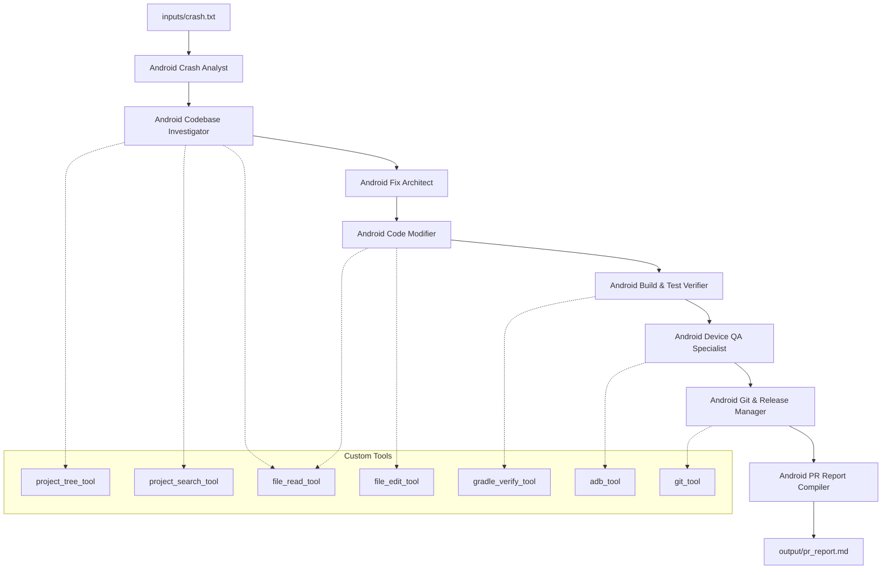

# 🚀 Android PR Reviewer & Crash Fix Agent: System Documentation

This repository houses a highly modular, state-of-the-art **8-Agent and 8-Task CrewAI Pipeline** designed to automate the intake, analysis, planning, patching, compilation, device validation, release, and pull-request creation for Android application crashes.

Using DeepSeek-Chat (V3/V4 API) as the underlying LLM engine over standard OpenAI-compatible tool calling, the system parses crash files, locates files within an Android codebase, modifies code in-place, compiles the project, runs device checks via ADB, and force-pushes clean fix branches to GitHub.

---

## 🏗️ System Architecture



---

## 🤖 The 8-Agent Modular Team

Each agent has a single-concern focus, running in sequential execution order. Configured inside `agents/`, their parameters are defined as follows:

| Agent Name | Config File | Role | Goal | Backstory |
| :--- | :--- | :--- | :--- | :--- |
| **Android Crash Analyst** | `android_crash_analyst.jsonc` | Android Crash Analyst | Extract and analyze crash log contexts to compile a structured intake report. | A senior mobile developer specializing in debugging, core stack traces, and crash diagnostics. |
| **Android Codebase Investigator** | `android_codebase_investigator.jsonc` | Android Codebase Investigator | Browse and search the target Android project to locate files, symbols, and dependencies relevant to the crash context. | An engineer specializing in code index analysis, file structure discovery, and tracing references. |
| **Android Fix Architect** | `android_fix_architect.jsonc` | Android Fix Architect | Plan a minimal, lifecycle-safe, and clean-code Android patch to resolve the crash. | A senior Android technical architect reviewing code patterns and designing minimal, safe patches (MVVM). |
| **Android Code Modifier** | `android_code_modifier.jsonc` | Android Code Modifier | Apply targeted Kotlin/Compose modifications to project files using exact search-and-replace blocks. | A precise Android software engineer writing clean, targeted patches that match surrounding whitespace/indentation. |
| **Android Build & Test Verifier** | `android_build_verifier.jsonc` | Android Build & Test Verifier | Verify the compilation status of the project after edits are applied, analyze errors, and report status. | A reliability engineer operating Gradle compilation tasks and feedback-looping compiler warnings. |
| **Android Device QA Specialist** | `android_device_operator.jsonc` | Android Device QA Specialist | Operate ADB commands to check active emulators, capture logs, and take screenshots to verify runtime status. | A QA automation specialist verifying runtime stability, checking layouts, and scanning logs. |
| **Android Git & Release Manager** | `android_git_release_manager.jsonc` | Android Git & Release Manager | Manage Git branches, stage modifications, commit changes, and push feature branches to GitHub. | A release manager who handles git operations, formats descriptive commits, and creates remote branches. |
| **Android PR Report Compiler** | `android_pr_report_compiler.jsonc` | Android PR Report Compiler | Combine individual phase reports into a single, comprehensive, and review-ready Markdown report. | A lead technical writer coordinating release notes, test summaries, and compilation reports. |

---

## 🛠️ Custom Android Tools

Tools are implemented in the `tools/` directory as CrewAI-compatible classes extending `BaseTool` and using `pydantic` schemas for safe input validation.

### 1. Project Tree Tool (`project_tree_tool.py`)
- **Purpose:** Generates a recursive directory layout of the Android project (limited to `max_depth` to prevent token limits).
- **Parameters:**
  - `android_project_path` (str): Absolute path to the Android project root.
  - `max_depth` (int, default=3): Directory traversal limit.

### 2. Project Search Tool (`project_search_tool.py`)
- **Purpose:** Searches for symbols, classes, files, or strings using file content scanners.
- **Parameters:**
  - `android_project_path` (str): Absolute path to the Android project root.
  - `query` (str): Text string or token to search for.

### 3. File Read Tool (`file_read_tool.py`)
- **Purpose:** Reads contents of specific files with line numbers. Supports line-range parameters.
- **Parameters:**
  - `android_project_path` (str)
  - `relative_file_path` (str)
  - `start_line` (int, default=1): Start line number.
  - `end_line` (int, optional): End line number.
  - `max_lines` (int, default=500): Truncation safety limit.

### 4. File Edit Tool (`file_edit_tool.py`)
- **Purpose:** Applies in-place, whitespace-insensitive modifications to code files using a regex matching and automatic indentation matching engine.
- **Parameters:**
  - `android_project_path` (str)
  - `relative_file_path` (str)
  - `target_content` (str): Search code block (indentation-independent).
  - `replacement_content` (str): Replacement code block (relative indentation is preserved).

### 5. Gradle Verify Tool (`gradle_verify_tool.py`)
- **Purpose:** Compiles the project and runs unit tests.
- **Parameters:**
  - `android_project_path` (str)
  - `tasks` (List[str], default=`[':app:compileDevDebugKotlin']`): Specific Gradle compilation tasks.

### 6. ADB Tool (`adb_tool.py`)
- **Purpose:** Connects to Android emulators or physical devices to verify app state.
- **Parameters:**
  - `android_project_path` (str)
  - `command_type` (str): Choice of `list_devices`, `launch_app`, `screencap`, or `get_logcat`.

### 7. Git Tool (`git_tool.py`)
- **Purpose:** Performs git operations. Automatically force-pushes features to remote tip.
- **Parameters:**
  - `command_type` (str): Choice of `get_status`, `create_branch`, `commit_changes`, or `create_pr`.
  - `branch_name` (str)
  - `commit_message` (str)

---

## 🔄 Sequential Pipeline Execution Flow

When you execute `uv run run.py`, the following sequence fires:

```
[Start] --> Read crash.txt (Inputs)
           │
           ▼
[Task 1] Analyst parses crash.txt --> Output: crash_intake_report.md
           │
           ▼
[Task 2] Investigator searches codebase --> Output: codebase_investigation.md
           │
           ▼
[Task 3] Architect devises minimal plan --> Output: fix_plan.md
           │
           ▼
[Task 4] Modifier edits HomeScreen.kt in-place --> Output: modification_result.md
           │
           ▼
[Task 5] Verifier runs Gradle :app:compile task --> Output: build_verification.md
           │
           ▼
[Task 6] QA Specialist list devices/logcat --> Output: device_verification.md
           │
           ▼
[Task 7] Release Manager checkout, commit, & auto push --> Output: git_release.md
           │
           ▼
[Task 8] Compiler aggregates files into PR description --> Output: pr_report.md
           │
           ▼
[Finish] --> Pushed branch & GitHub PR Compare URL printed
```

---

## 🛠️ Execution & Environment Setup

### 1. Environment variables (`.env`)
```bash
# DeepSeek API credentials
DEEPSEEK_API_KEY=your_key_here
LLM_PROVIDER=deepseek

# OpenAI configuration override for standard tool calling
OPENAI_API_KEY=your_key_here
OPENAI_API_BASE=https://api.deepseek.com
```

### 2. Launch execution
Make sure an Android Emulator is running in Android Studio for the QA Agent, then run:
```bash
uv run run.py
```

### 3. Generated output files
All reports are saved inside the `output/` directory:
- `output/crash_intake_report.md`
- `output/codebase_investigation.md`
- `output/fix_plan.md`
- `output/modification_result.md`
- `output/build_verification.md`
- `output/device_verification.md`
- `output/git_release.md`
- `output/pr_description.md`
- `output/pr_report.md` (PR summary)
- `output/submit_pr.sh` (Local push script fallback)
